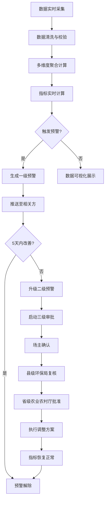

## 1. 产品概述

全国性畜禽养殖废弃物资源化利用与环保监管智能分析平台，实现对全国养殖场粪污处理全流程的实时监控、智能预警与科学决策。通过实时接入养殖场数据，自动计算资源化利用率、设施运行达标率和环境风险指数，构建分级预警机制与审批流程，为各级环保和农业部门提供数据支撑与决策依据。

- **核心目标**：实现畜禽养殖废弃物的资源化利用与环保监管的智能化、可视化、精准化
- **解决问题**：传统监管手段滞后、数据孤岛、预警不及时、决策缺乏数据支撑
- **目标用户**：国家级/省级/市级环保部门、农业农村部门、养殖场主
- **市场价值**：提升环保监管效率，降低环境污染风险，促进资源化利用产业发展

## 2. 核心功能

### 2.1 用户角色

| 角色 | 注册方法 | 核心权限 |
|------|----------|----------|
| 国家级管理员 | 系统分配 | 全国数据查看、全国报表统计、系统配置管理 |
| 省级管理员 | 系统分配 | 所辖省份数据查看、省级报表、审批流程管理 |
| 市级管理员 | 系统分配 | 所辖地市数据查看、市级报表、预警处理 |
| 县级环保局 | 系统分配 | 县域数据查看、预警复核、审批流程参与 |
| 省级农业农村厅 | 系统分配 | 审批流程最终决策、资源化利用指导 |
| 养殖场主 | 自主注册 | 本场数据查看、预警接收、工艺调整申请、年度计划上传 |

### 2.2 功能模块

1. **数据概览看板**：全国热力图、核心指标卡片、风险排名、预警列表
2. **实时监控中心**：养殖场列表、实时数据接入、处理设施运行监控、水体监测
3. **智能预警系统**：一级/二级预警自动生成、预警推送、预警处理跟踪
4. **养殖场详情**：粪污处理趋势、有机肥产出对比、运输车辆轨迹、历史数据
5. **预测规划中心**：年度计划上传、存栏变化提取、粪污产出预测、扩产/外运方案推荐
6. **审批流程管理**：三级审批流程（场主确认→县级复核→省级批准）、审批记录跟踪
7. **诊断报告系统**：周度自动生成报告、同比环比分析、优化建议
8. **系统管理**：权限管理、用户管理、系统配置、数据字典

### 2.3 页面详情

| 页面名称 | 模块名称 | 功能描述 |
|---------|----------|----------|
| 登录页 | 身份认证 | 用户名密码登录、角色权限验证、记住密码 |
| 数据概览 | 全国热力图 | 按省份展示资源化利用率热力分布，支持切换指标 |
| 数据概览 | 核心指标卡 | 全国资源化利用率、设施达标率、环境风险指数、在产养殖场数 |
| 数据概览 | 风险排名 | TOP10高风险省份/养殖场排名，支持按工艺筛选 |
| 数据概览 | 预警列表 | 实时展示最新预警，支持按级别、状态筛选 |
| 实时监控 | 养殖场列表 | 多条件筛选（省份、规模、工艺、风险等级）、数据导出 |
| 实时监控 | 设施运行监控 | 实时展示处理设施运行参数、达标状态 |
| 实时监控 | 水体监测 | 周边水体监测数据展示、超标告警 |
| 预警中心 | 预警总览 | 预警统计、预警趋势、待处理预警 |
| 预警中心 | 预警详情 | 预警原因分析、历史数据对比、处理建议 |
| 养殖场详情 | 趋势分析 | 近7天粪污产生量、处理量、资源化利用率趋势曲线 |
| 养殖场详情 | 产出对比 | 有机肥产出与销售对比图表、库存分析 |
| 养殖场详情 | 运输轨迹 | 运输车辆实时位置、历史轨迹回放、运输路线优化 |
| 预测规划 | 计划上传 | Excel年度养殖计划上传、存栏数据自动提取校验 |
| 预测规划 | 产出预测 | 未来90天粪污产出预测曲线、处理能力匹配分析 |
| 预测规划 | 方案推荐 | 扩产方案、外运方案智能推荐、成本效益分析 |
| 审批中心 | 待审批列表 | 待处理审批事项、审批流程可视化 |
| 审批中心 | 审批详情 | 申请材料查看、审批意见填写、历史审批记录 |
| 报告中心 | 报告列表 | 周度诊断报告列表、报告下载、历史对比 |
| 报告中心 | 报告详情 | 资源化利用率分析、设施故障分布、水体影响评估、优化建议 |
| 系统管理 | 用户管理 | 用户增删改查、角色分配、权限配置 |
| 系统管理 | 数据字典 | 养殖规模、处理工艺、行政区划等基础数据维护 |

## 3. 核心流程

### 3.1 数据采集与处理流程
养殖场物联网设备实时上传粪污产生量、处理设施运行参数、有机肥产出数据→数据清洗与校验→按养殖规模/处理工艺/产区聚合→实时计算资源化利用率、设施运行达标率、环境风险指数→数据持久化与可视化展示

### 3.2 预警触发与处理流程
实时监控指标→连续3天设施达标率<70%或风险指数超阈值→自动生成一级预警→推送至场主和属地环保局→5天内未改善→升级为二级预警→启动三级审批流程→场主确认调整方案→县级环保局复核→省级农业农村厅批准→执行工艺调整或限产→指标恢复正常→预警解除

### 3.3 年度计划与预测流程
用户上传年度养殖计划Excel→系统自动提取存栏变化数据→结合历史粪污产出系数→预测未来90天粪污产出量→与处理能力对比分析→超出处理能力时→智能推荐最优扩产方案或外运方案→用户确认方案→生成实施计划

## 4. 用户界面设计

### 4.1 设计风格
- **主色调**：深青色(#0F766E)代表环保与科技，辅以森林绿(#059669)代表农业与生态
- **辅助色**：橙色(#F59E0B)用于一级预警，红色(#DC2626)用于二级预警，绿色(#10B981)用于正常状态
- **背景色**：浅灰蓝(#F8FAFC)为主体背景，白色卡片配合微妙阴影
- **按钮风格**：圆角8px，悬停有轻微上浮效果，渐变填充体现科技感
- **字体**：标题使用"思源黑体 Bold"，正文使用"思源宋体 Regular"，数据展示使用"Roboto Mono"等宽字体
- **布局风格**：顶部导航+左侧菜单+右侧内容区的经典后台布局，卡片式模块划分，数据可视化区域突出
- **图标风格**：使用Font Awesome线性图标，配合适度动画效果

### 4.2 页面设计概述

| 页面名称 | 模块名称 | UI元素 |
|---------|----------|--------|
| 数据概览 | 全国热力图 | 中国地图组件，省份颜色渐变映射指标值，hover显示详情，点击下钻 |
| 数据概览 | 核心指标卡 | 大号数字展示，环比趋势箭头，渐变色背景，圆角卡片 |
| 数据概览 | 风险排名 | 横向柱状图，红色渐变标记高风险项，支持排序切换 |
| 数据概览 | 预警列表 | 时间线式布局，不同级别预警用不同颜色标记，状态标签 |
| 养殖场详情 | 趋势分析 | ECharts多线图，支持图例切换、数据zoom、数据点详情 |
| 养殖场详情 | 运输轨迹 | 地图组件，车辆标记点，轨迹线路，播放控制条 |
| 预测规划 | 产出预测 | 面积图展示预测区间，虚线标记处理能力阈值，风险区域高亮 |
| 报告中心 | 报告详情 | 分章节卡片布局，关键指标高亮，图表与文字说明结合 |

### 4.3 响应式
- 采用桌面优先设计，最小支持1280px宽度
- 平板端自适应调整侧边栏宽度，优化表格列展示
- 移动端简化为核心数据展示，侧边栏改为抽屉式
- 所有图表支持容器自适应，触控操作优化
- 表格在小屏幕下转为卡片式列表展示

### 4.4 3D场景指引
本项目不涉及3D场景，重点在于数据可视化的2D呈现效果。
