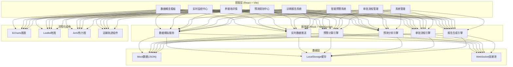
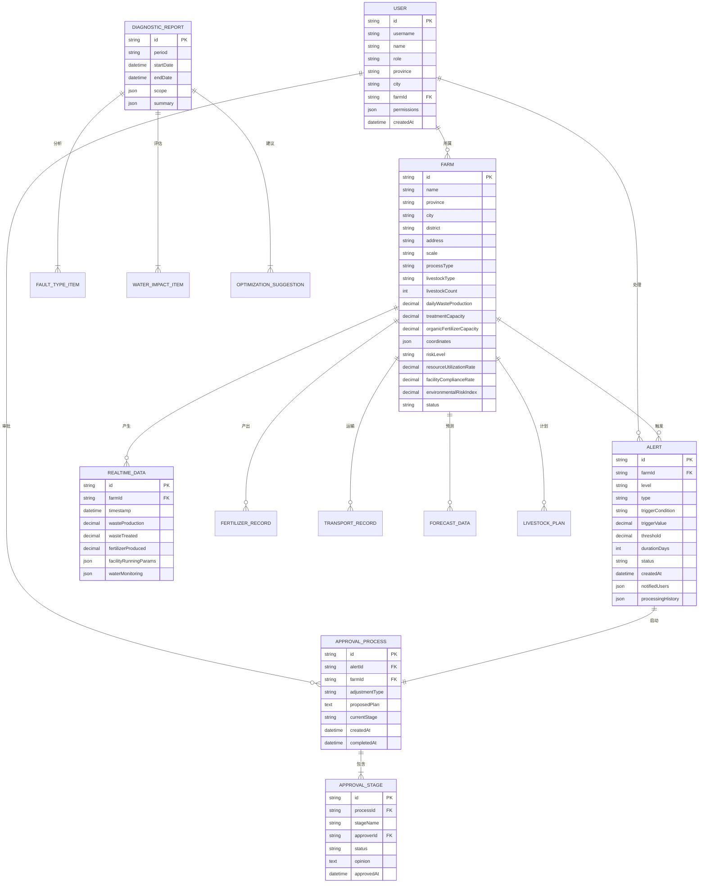

## 1. 架构设计



## 2. 技术描述

- **前端框架**：React@18.2.0 + TypeScript@5.0
- **构建工具**：Vite@5.0
- **状态管理**：Zustand@4.5（轻量级状态管理）
- **路由管理**：React Router@6.21
- **UI组件库**：Ant Design@5.12
- **样式方案**：Tailwind CSS@3.4
- **数据可视化**：ECharts@5.4 + @ant-design/charts@1.4
- **地图组件**：Leaflet@1.9 + react-leaflet@4.2
- **图标库**：@ant-design/icons@5.2 + lucide-react@0.309
- **Excel处理**：xlsx@0.18
- **WebSocket**：原生WebSocket API（模拟实时数据推送）
- **日期处理**：dayjs@1.11
- **后端**：无后端，使用Mock数据模拟
- **数据库**：LocalStorage + JSON文件

## 3. 路由定义

| 路由路径 | 页面名称 | 权限级别 | 说明 |
|---------|----------|----------|------|
| /login | 登录页 | 公开 | 用户身份认证 |
| /dashboard | 数据概览 | 所有登录用户 | 全国热力图、核心指标、风险排名 |
| /monitor | 实时监控 | 所有登录用户 | 养殖场列表、设施监控、水体监测 |
| /monitor/farm/:id | 养殖场详情 | 所有登录用户 | 趋势分析、产出对比、运输轨迹 |
| /alert | 预警中心 | 所有登录用户 | 预警列表、预警详情、预警处理 |
| /forecast | 预测规划 | 场主+管理员 | 计划上传、产出预测、方案推荐 |
| /approval | 审批中心 | 相关审批角色 | 待审批列表、审批详情、审批操作 |
| /report | 报告中心 | 所有登录用户 | 诊断报告列表、报告详情、报告下载 |
| /system/users | 用户管理 | 国家级管理员 | 用户增删改查、角色分配 |
| /system/dict | 数据字典 | 国家级管理员 | 基础数据维护 |
| * | 404页面 | 公开 | 路由未匹配 |

## 4. API定义

### 4.1 类型定义

```typescript
// 用户类型
interface User {
  id: string;
  username: string;
  name: string;
  role: 'national' | 'provincial' | 'municipal' | 'county_epd' | 'provincial_agri' | 'farm_owner';
  province?: string;
  city?: string;
  farmId?: string;
  permissions: string[];
}

// 养殖场类型
interface Farm {
  id: string;
  name: string;
  province: string;
  city: string;
  district: string;
  address: string;
  scale: 'small' | 'medium' | 'large';
  processType: string;
  livestockType: string;
  livestockCount: number;
  dailyWasteProduction: number;
  treatmentCapacity: number;
  organicFertilizerCapacity: number;
  coordinates: [number, number];
  riskLevel: 'normal' | 'warning' | 'danger';
  resourceUtilizationRate: number;
  facilityComplianceRate: number;
  environmentalRiskIndex: number;
  status: 'active' | 'suspended' | 'closed';
}

// 实时数据类型
interface RealtimeData {
  farmId: string;
  timestamp: number;
  wasteProduction: number;
  wasteTreated: number;
  fertilizerProduced: number;
  facilityRunningParams: {
    temperature: number;
    ph: number;
    oxygenLevel: number;
    powerConsumption: number;
  };
  waterMonitoring: {
    cod: number;
    ammoniaNitrogen: number;
    totalPhosphorus: number;
    dissolvedOxygen: number;
  };
}

// 预警类型
interface Alert {
  id: string;
  farmId: string;
  farmName: string;
  level: 'level1' | 'level2';
  type: 'facility' | 'environment' | 'comprehensive';
  triggerCondition: string;
  triggerValue: number;
  threshold: number;
  durationDays: number;
  status: 'pending' | 'processing' | 'resolved' | 'escalated';
  createdAt: number;
  notifiedUsers: string[];
  processingHistory: ProcessingRecord[];
}

// 审批流程类型
interface ApprovalProcess {
  id: string;
  alertId: string;
  farmId: string;
  adjustmentType: 'process_change' | 'production_limit';
  proposedPlan: string;
  currentStage: 'farm_owner' | 'county_epd' | 'provincial_agri' | 'completed' | 'rejected';
  stages: ApprovalStage[];
  createdAt: number;
  completedAt?: number;
}

// 诊断报告类型
interface DiagnosticReport {
  id: string;
  period: 'weekly';
  startDate: number;
  endDate: number;
  scope: {
    type: 'national' | 'province' | 'city';
    region?: string;
  };
  summary: {
    resourceUtilizationRate: {
      current: number;
      yoy: number;
      mom: number;
    };
    facilityComplianceRate: {
      current: number;
      yoy: number;
      mom: number;
    };
    alertCount: {
      level1: number;
      level2: number;
      total: number;
    };
  };
  facilityFaultDistribution: FaultTypeItem[];
  waterImpactAssessment: WaterImpactItem[];
  optimizationSuggestions: OptimizationSuggestion[];
}

// 预测数据类型
interface ForecastData {
  farmId: string;
  forecastDate: number;
  forecastDays: number;
  baselineLivestockCount: number;
  plannedLivestockCount: number[];
  predictedWasteProduction: number[];
  treatmentCapacity: number;
  capacityGap: number[];
  recommendations: PlanRecommendation[];
}
```

### 4.2 Mock API 接口

```typescript
// 认证接口
POST /api/auth/login → { token: string; user: User }
POST /api/auth/logout → { success: boolean }

// 养殖场接口
GET /api/farms → Farm[] (支持筛选: province, scale, processType, riskLevel)
GET /api/farms/:id → Farm
GET /api/farms/:id/realtime → RealtimeData
GET /api/farms/:id/history → { dates: string[]; data: RealtimeData[] }
GET /api/farms/:id/fertilizer → { dates: string[]; production: number[]; sales: number[] }
GET /api/farms/:id/transport → TransportRecord[]

// 指标接口
GET /api/metrics/national → { resourceUtilizationRate, facilityComplianceRate, environmentalRiskIndex, activeFarms }
GET /api/metrics/province/:province → ProvinceMetric[]
GET /api/metrics/heatmap → HeatmapItem[] (按省份聚合)

// 预警接口
GET /api/alerts → Alert[] (支持筛选: level, status, dateRange)
GET /api/alerts/:id → Alert
POST /api/alerts/:id/process → { action: string; remark: string }
POST /api/alerts/:id/escalate → { success: boolean }

// 审批接口
GET /api/approvals/pending → ApprovalProcess[]
GET /api/approvals/:id → ApprovalProcess
POST /api/approvals/:id/approve → { stage: string; opinion: string }
POST /api/approvals/:id/reject → { stage: string; reason: string }

// 预测接口
POST /api/forecast/upload → (Excel文件) → { extractedData: LivestockPlan[] }
POST /api/forecast/calculate → { farmId, planData } → ForecastData
GET /api/forecast/:farmId → ForecastData

// 报告接口
GET /api/reports → DiagnosticReport[]
GET /api/reports/:id → DiagnosticReport
GET /api/reports/:id/download → PDF文件流

// 系统接口
GET /api/users → User[]
POST /api/users → User
PUT /api/users/:id → User
DELETE /api/users/:id → { success: boolean }
GET /api/dict/:type → DictItem[]
```

## 5. 数据模型

### 5.1 ER图



### 5.2 模拟数据结构

```typescript
// Mock数据初始化脚本

// 1. 行政区划数据
const provinces = [
  { code: '11', name: '北京市' },
  { code: '12', name: '天津市' },
  { code: '13', name: '河北省' },
  { code: '14', name: '山西省' },
  { code: '15', name: '内蒙古自治区' },
  { code: '21', name: '辽宁省' },
  { code: '22', name: '吉林省' },
  { code: '23', name: '黑龙江省' },
  { code: '31', name: '上海市' },
  { code: '32', name: '江苏省' },
  { code: '33', name: '浙江省' },
  { code: '34', name: '安徽省' },
  { code: '35', name: '福建省' },
  { code: '36', name: '江西省' },
  { code: '37', name: '山东省' },
  { code: '41', name: '河南省' },
  { code: '42', name: '湖北省' },
  { code: '43', name: '湖南省' },
  { code: '44', name: '广东省' },
  { code: '45', name: '广西壮族自治区' },
  { code: '46', name: '海南省' },
  { code: '50', name: '重庆市' },
  { code: '51', name: '四川省' },
  { code: '52', name: '贵州省' },
  { code: '53', name: '云南省' },
  { code: '54', name: '西藏自治区' },
  { code: '61', name: '陕西省' },
  { code: '62', name: '甘肃省' },
  { code: '63', name: '青海省' },
  { code: '64', name: '宁夏回族自治区' },
  { code: '65', name: '新疆维吾尔自治区' },
];

// 2. 处理工艺数据
const processTypes = [
  { code: 'compost', name: '好氧堆肥', efficiency: 0.85 },
  { code: 'biogas', name: '沼气工程', efficiency: 0.78 },
  { code: 'separation', name: '固液分离', efficiency: 0.72 },
  { code: 'fermentation', name: '生物发酵', efficiency: 0.88 },
  { code: 'membrane', name: '膜处理', efficiency: 0.92 },
  { code: 'ecological', name: '生态处理', efficiency: 0.65 },
];

// 3. 养殖类型数据
const livestockTypes = [
  { type: 'pig', name: '生猪', wasteCoefficient: 5.2 },
  { type: 'cow', name: '奶牛', wasteCoefficient: 28.5 },
  { type: 'beef', name: '肉牛', wasteCoefficient: 18.3 },
  { type: 'chicken', name: '蛋鸡', wasteCoefficient: 0.12 },
  { type: 'broiler', name: '肉鸡', wasteCoefficient: 0.08 },
  { type: 'sheep', name: '肉羊', wasteCoefficient: 3.6 },
  { type: 'duck', name: '肉鸭', wasteCoefficient: 0.15 },
];

// 4. 初始测试用户
const initialUsers = [
  {
    id: 'user_001',
    username: 'admin_national',
    password: 'admin123',
    name: '国家级管理员',
    role: 'national',
    permissions: ['all'],
  },
  {
    id: 'user_002',
    username: 'admin_shandong',
    password: 'admin123',
    name: '山东省管理员',
    role: 'provincial',
    province: '37',
    permissions: ['view_province', 'approval'],
  },
  {
    id: 'user_003',
    username: 'farm_owner_001',
    password: 'farm123',
    name: '惠民养殖场场主',
    role: 'farm_owner',
    farmId: 'farm_001',
    permissions: ['view_farm', 'upload_plan', 'confirm_adjustment'],
  },
  {
    id: 'user_004',
    username: 'county_epd_001',
    password: 'epd123',
    name: '惠民县环保局',
    role: 'county_epd',
    province: '37',
    city: '16',
    permissions: ['review_approval', 'view_county'],
  },
  {
    id: 'user_005',
    username: 'provincial_agri_001',
    password: 'agri123',
    name: '山东省农业农村厅',
    role: 'provincial_agri',
    province: '37',
    permissions: ['final_approval', 'view_province'],
  },
];
```
